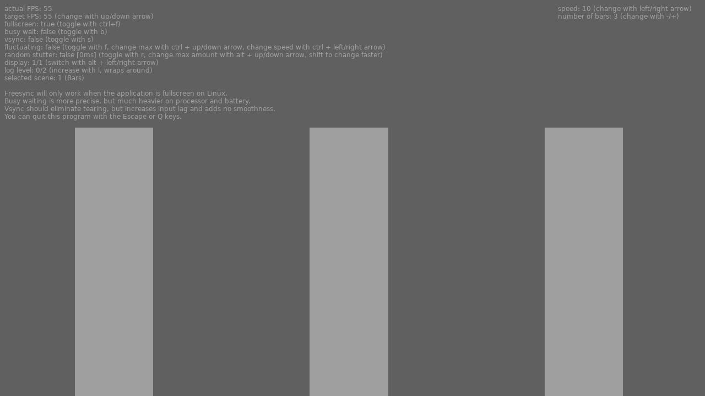

# Unofficial Snap Packaging for VRRTest

 Icon of VRRTest")

**This is the unofficial snap for VRRTest**, *"A small utility to test Variable Refresh Rate(VRR) capable displays on Linux."*. It works on Ubuntu, Fedora, Debian, and other major Linux distributions.

Published for  with 💝 by Snapcrafters

## Installation

([Don't have snapd installed?](https://snapcraft.io/docs/core/install))

### In a Terminal

    # Install the snap #
    sudo snap install vrrtest

    # Launch the application #
    vrrtest

### The Graphical Way

## What is Working

This section enumerates the functionalities that are tested to be working in
this snap:

* Bars scene
* Squares scene
* Full screen

## What is NOT Working...yet

Check out the [issue tracker](https://github.com/_repo_owner_id_/_repo_name_id_/issues) for known issues.

## Support

* Report issues regarding using this snap to the issue tracker:  
  <https://gitlab.com/brlin/vrrtest-snap/-/issues>
* You may also post on the Snapcraft Forum, under the `snap` topic category:  
  <https://forum.snapcraft.io/c/snap>
